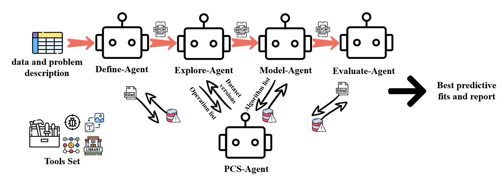

# VDSAgent: A PCS-Guided Multi-Agent System for Veridical Data Science Automation

**VDSAgents** is a multi-agent system guided by the Predictability-Computability-Stability (PCS) principles, designed to automate veridical data science. The system implements a modular and interpretable workflow for data cleaning, feature engineering, modeling, and evaluation. Each phase is managed by an elegant agent, ensuring both functionality and scientific auditability.

## 🌟 Key Features

- **DSLC Data Science Workflow**: Automates various stages of data science
- **PCS Principles**: Ensures system reliability and robustness
- **Multi-Dataset Evaluation**: Validated across diverse datasets

## 🙏 Acknowledgements

Special thanks to Silan Hu for providing an online version of the project, which requires no installation. You can access it at [https://easy-notebook.silan.tech/](https://easy-notebook.silan.tech/).

## 📦 Installation

**Note:** This project requires Python 3.9 or above.

### Using Conda

```bash
conda env create -f environment.yml
conda activate VDSAgent
```

### Using Pip

```bash
pip install -r requirements.txt
```

## 🚀 QuickStart

To configure the project, you need to fill in the `config.py` file with your API details:

1. **BASE_URL**: Set this to the base URL of your API service.
2. **API_KEY**: Enter your API key here.

These configurations are necessary for the language model to function correctly. Ensure that you have the correct permissions and access rights to use the API.

To use your own dataset, please store your training and test data in the `data_science_project` directory following this structure:

```
- data_science_project/
  - <your_project_name>/
    - data/
      - train.csv
      - test.csv
```

Next, open the `run_experiments.py` file and modify the following parameters in the `main` function:

1. `COMPETITION_NAME`: Set this to your project name, e.g., `COMPETITION_NAME = '<your_project_name>'`.
2. `PROBLEM_DESCRIPTION` and `CONTEXT_DESCRIPTION`: Optionally, update these strings to describe your specific problem and context.

After making these changes, you can run your experiments using the following command:

```bash
python run_experiments.py
```

## 📈 Framework and Performance

Below are the framework and performance comparison diagrams:

- 
- 

## 🤝 Contributing

Contributions are welcome! Please feel free to open issues or submit pull requests for any improvements or bug fixes.

## 📜 License

This project is licensed under the MIT License - see the [LICENSE](LICENSE) file for details. 

## 👥 Authors

- **Yunxuan Jiang**: School of Management, Xi’an Jiaotong University; [fengjianliu@stu.xjtu.edu.cn](mailto:fengjianliu@stu.xjtu.edu.cn)
- **Silan Hu**: National University of Singapore; [silan.hu@u.nus.edu](mailto:silan.hu@u.nus.edu). Yunxuan Jiang and Silan Hu have equally contributed to this work.
- **Xiaoning Wang**: School of Data Science and Media Intelligence, Communication University of China; [sdwangxiaoning@cuc.edu.cn](mailto:sdwangxiaoning@cuc.edu.cn)
- **Yuanyuan Zhang**: Beijing Baixingkefu Network Technology Co., Ltd.; [zhang.huanzhiyuan@gmail.com](mailto:zhang.huanzhiyuan@gmail.com)
- **Xiangyu Chang**: School of Management, Xi’an Jiaotong University; [xiangyuchang@xjtu.edu.cn](mailto:xiangyuchang@xjtu.edu.cn) 

## 📄 Publication Status

This work is currently under submission for publication. We appreciate your interest and support. 
